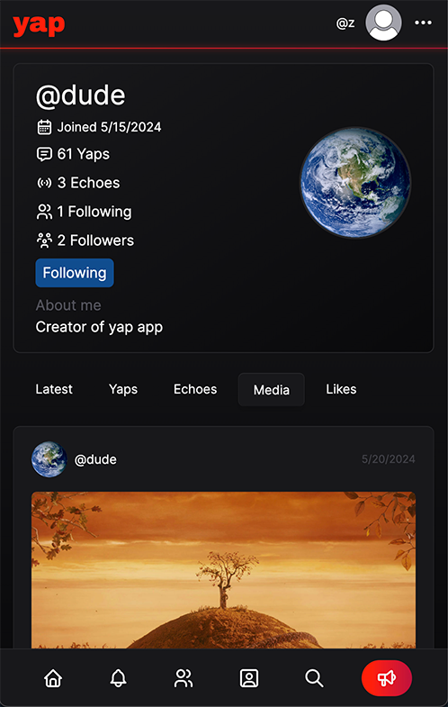

# yap-app

Site is currently deployed [here](https://yap-app.onrender.com).

This app is a Twitter-like social media app where users can register with Github OAuth or email/password credentials, then Yap and Echo posts (Tweet and Retweet respectively). Yaps can have text and/or an image attached. Text is parsed for @user mentions, which will automatically link to the mentioned user. Image hosting is provided by [uploadthing](https://uploadthing.com/) and their provided UTApi Server SDK.

Users can customize their profile by uploading an avatar, writing a bio, and adding a display name. Users can also follow other users, and automatically follow me upon registering by default. When a user likes, echoes, or replies to your yap, you will receive a live notification update via Server Sent Events (SSE) as indicated by the swinging bell icon. Counters next to like and echo buttons are abbreviated to xK and xM numbers at the 1000 and 1000000 threshold (though they will never reach those numbers 😭).

Users can search through yaps on the search page, which supports operations detailed in the [Prisma docs](https://www.prisma.io/docs/orm/prisma-client/queries/full-text-search). Pagination is implemented with Link elements, searchParams and a Prisma native/raw SQL cursor.

The app is built with Next.js App Router and takes into consideration the best practices as detailed in their documentation. This includes:

- Fetching data on the server with React Server Components
- Mutating data with Server Actions
- Parallel data fetching to avoid waterfalls
- Nested layouts
- Progressive rendering with Suspense
- React.cache() to dedupe requests during the Request/Response cycle
- Edge-compatible database adapter for use in middleware

Tailwind, react-hook-form, react-icons, and shadcn were some of the tools used to create the frontend. A Postgres database provided by [Neon](https://neon.tech) is used in conjunction with Prisma ORM which provides great type safety for queries. Zod and zod-form-data are used to provide validation on user inputs. Authentication was painfully implemented with Auth.js (next-auth v5).

# Local Installation

1. Clone this repository

2. Create a .env file in root containing:

- a DATABASE_URL key (your postgres database connection string)
- an AUTH_SECRET key for Auth.js
- your GITHUB_CLIENT_ID and GITHUB_SECRET (for OAuth)
- your UPLOADTHING_APP_ID and UPLOADTHING_SECRET
- an AUTH_TRUST_HOST key set to true
- a NEXT_PUBLIC_APP_URL and NEXTAUTH_URL set to your deployed host url with no trailing forward slash.
- an optional AUTOFOLLOW key, containing the username of any user you want newly registered users to automatically follow.

3. Navigate to the project in terminal and run the build script

```console
$ pnpm install --frozen-lockfile; pnpm run build
```

4. Run start

```console
$ pnpm run start
```

5. Navigate localhost:3000 in the browser


